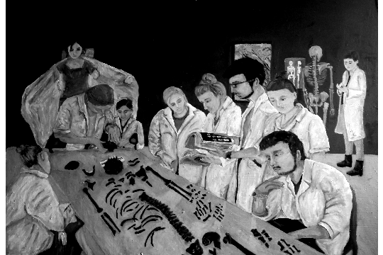

### BioProfile Introduction

 

BioProfile is an app that uses the results of standard osteological methods to create a basic biological profile (age, sex and ancestry). 

In osteological research the Biological profile is the first crucial step of data analysis. This app makes this assessment simple and reproducible.  


----

### App use: Known and Unknown values

BioProfile has 3 input tabs (Ancestry, Age and Sex) for the user to input data. 

Sometime osteological analysis one of these values will be known from other sources. Therefore, the first option in each tab is whether that aspect is known or unknown. Based on this selection different input widgets will be displayed. For example age:


```r
library(png);library(grid)
img <- readPNG("screenshots.png"); grid.raster(img)
```

 

-----

### App use: Unknown inputs, incomplete analysis. 

Another fact of osteological analysis is the problem of incomplete remains. This means that not all aspects can be recorded for each set of remains. 

BioProfile allows the user to input only the information they have and still get a result. Each field allows the use to specify it as unknown. In the ancestry input this is done by selecting undeterminable, age inputs use NA and the sex input panel uses 0 values on the sliders and blank numerical input fields.  

Of course the most reliable results are gain from complete analysis so the output for each field will include a warning message if there are missing values. 


```r
# example of warning for missing data in sex input, sex() function

w3<-if(anyNA(results)){"Your input was incomplete please note that the
                       most reliable results come from complete analysis"}
```

---

### App use: Interrelated functions and conditionalPanel outputs 

To create the output BioProfile uses a series of interconnecting functions located in the helpers.R file:

1. Ancestory(). Uses input from the ancestry panel to determine ancestry.

2. SubAdult(). Uses the epiphysis check boxes on the age panel to distinguish adult and subadult remains. 

3. Sex(). Uses input from the sex panel as well as ancestry and subadult results to determine sex.

4. Adult(). Uses input from the age panel (minus the epiphysis data) and sex to estimate age. 

Because of the ability to input known data and the interrelated nature of the functions there are multiple iterations of some of the function calls. Which iteration to use and which results to display is determined by conditionalPanels in ui.R. 

Annotated .txt copies of each function, ui.R and server.R can be found at https://github.com/AlisJay/BioProfile. 


